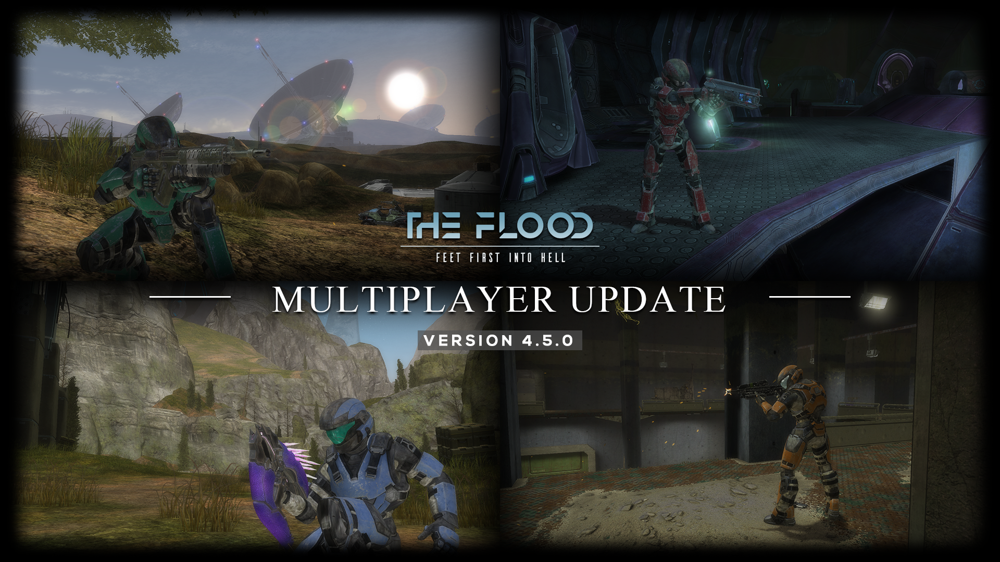
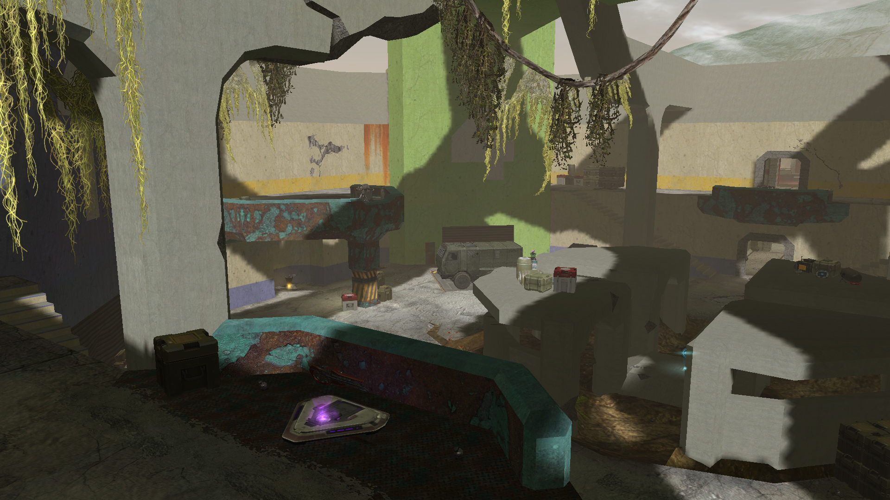
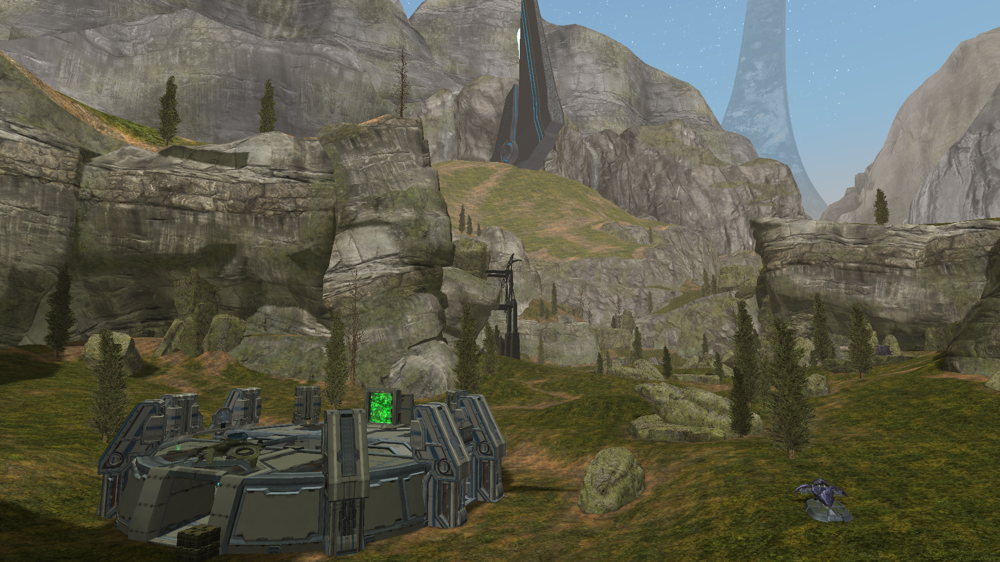
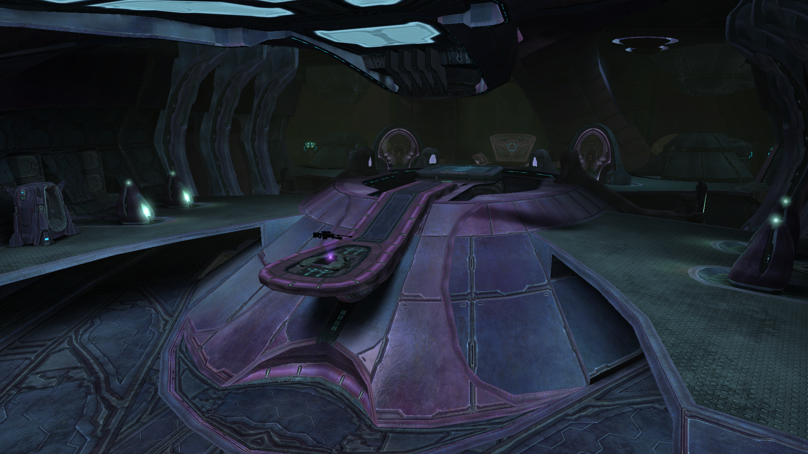
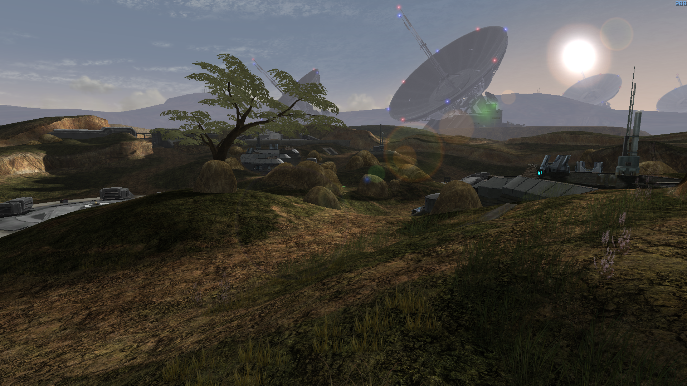
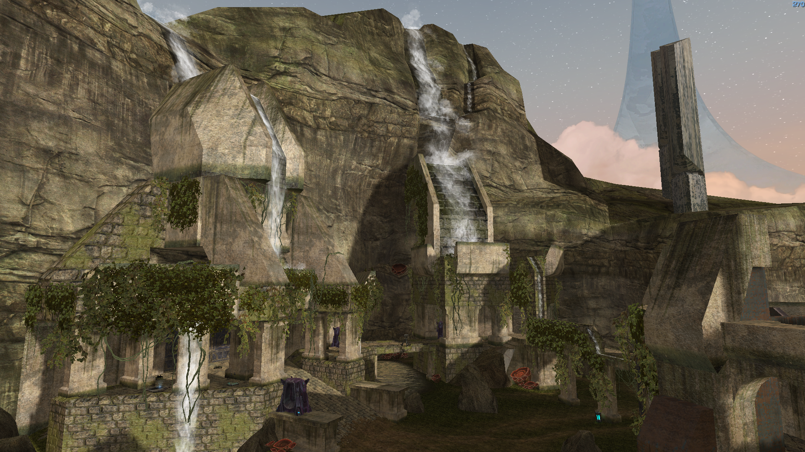
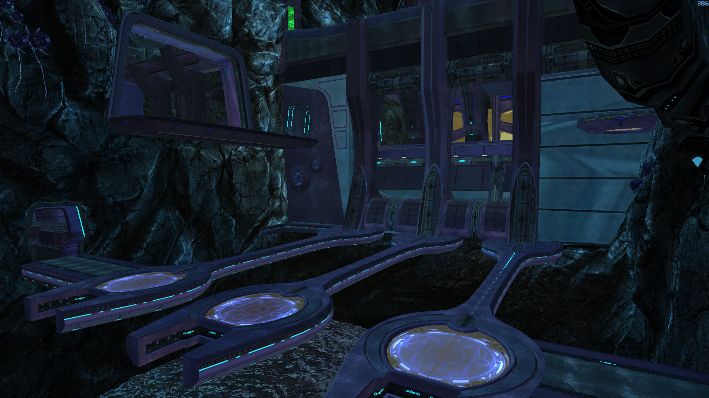

<html>
    <p align="center">
        
    </p>
</html>

# Helljumper Multiplayer
Helljumper Multiplayer is a mod for Halo: Custom Edition developed by the Keymind Studios.

The multiplayer featuring a vast catalog of maps section is comprised of original maps and remakes of aclaimed classics and a rich sandbox built on the foundations of all Halo titles.

### Join to our [Discord](https://discord.gg/scGaaAFqm8) server to get more detailed info

We constantly make updates.

# Getting Helljumper Multiplayer
Get the latest version available using [Mercury](https://github.com/Sledmine/Mercury/releases)
with the following line on the terminal:
```
mercury install helljumpermp
```
Or you can install the package using the new Mercury UI 


This mod need [Chimera](https://github.com/SnowyMouse/chimera) to work, lua scripting is another function being used from this. (Mercury installs chimera automatically)

# Screenshots

We have 4 maps by now and others on development too.

### Currently version `5.0.0`


### Treason


### Bleed It Out


### Last Voyage


### Impasse


### Next version `4.5.5`

### Aqueduct


### Penance

